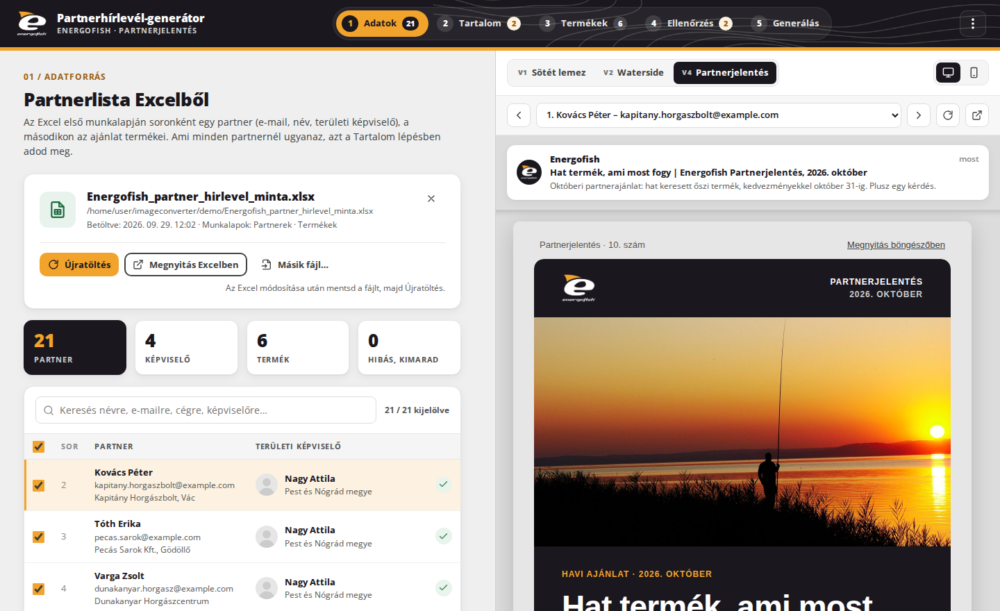
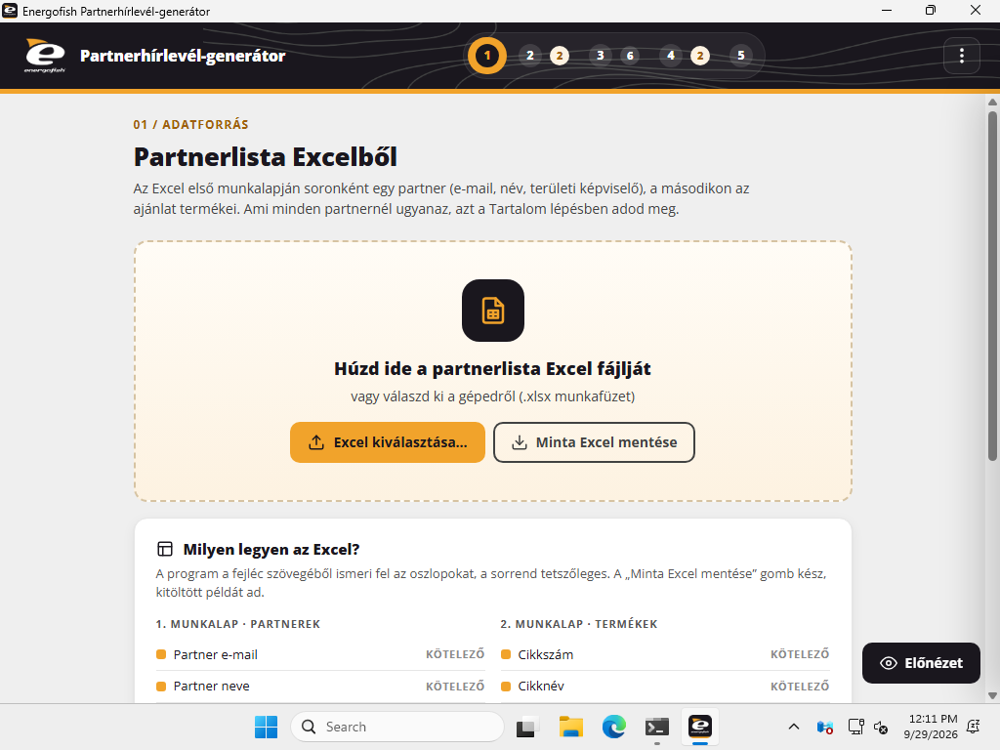
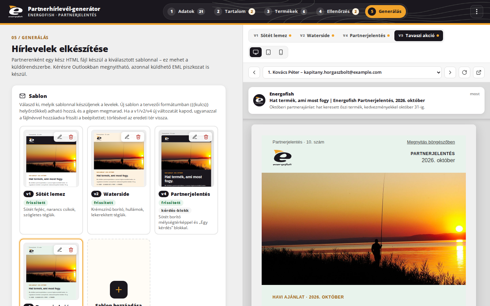

# Energofish Partnerhírlevél-generátor

Windowsos asztali program, amely egy partnerlistából **partnerenként legenerálja a hírlevelet** a tervezett Energofish-sablonok (v1 Sötét lemez, v2 Waterside, v4 Partnerjelentés) valamelyikével.

- Ami partnerenként más (e-mail, név, területi képviselő és a fotója, elérhetőségei), az a **B2B partnertörzsből** (célcsoport, képviselő, megye, besorolás… szerint összeállított halmaz, 1.3) vagy **Excelből** jön.
- A termékek az Excel **második munkalapjáról** jönnek (cikkszám, cikknév, kép link, gomb link…).
- Minden más, ami minden partnernél ugyanaz (tárgy, borító, levél, ajánlat szövegei, kérdés, lábléc…), a **programban** adható meg.
- Gépelés közben **élő előnézet** mutatja a levelet bármelyik partnerre, asztali és mobil nézetben.



---

## Letöltés és indítás

1. Töltsd le a legfrissebb kiadást a [Releases](https://github.com/VargaFerencINF/hirlevelgen/releases/latest) oldalról (vagy a [`dist/EnergofishHirlevel.exe`](dist/EnergofishHirlevel.exe) fájlt) (és ha kell, a [`dist/Energofish_partner_hirlevel_minta.xlsx`](dist/Energofish_partner_hirlevel_minta.xlsx) mintát).
2. Indítsd el dupla kattintással. Telepíteni nem kell, egyetlen fájl.



**Rendszerigény:** Windows 10 vagy 11. A program a Windowsba épített *Microsoft Edge WebView2* komponenssel jeleníti meg a felületét (Windows 11-en és frissített Windows 10-en megvan). Ha hiányzik, a program automatikusan az alapértelmezett böngészőben nyílik meg, és úgy is teljes értékűen működik.

> **„A Windows megvédte a számítógépet” üzenet:** a program nincs digitálisan aláírva, ezért az első indításnál a SmartScreen figyelmeztethet. Kattints a **További információ → Futtatás mindenképp** gombra.

---

## Használat 5 lépésben

| Lépés | Mit csinálsz |
|---|---|
| **1. Adatok** | *Partnerhalmaz összeállítása…* a B2B partnertörzsből (lásd lent), vagy húzd be az Excelt az ablakba / *Excel kiválasztása…*. Nincs még Excel? *Minta Excel mentése* – kész, kitöltött példa. A program kiírja, melyik oszlopot minek ismerte fel, és jelzi a hibás sorokat. A partnerek egyenként ki-be kapcsolhatók; egy sorra kattintva az előnézet arra a partnerre vált. |
| **2. Tartalom** | A közös szövegek, blokkonként (Alapadatok, Borító, Személyes levél, Ajánlat, Egy kérdés, Képviselő-blokk, Lábléc, Termék-linkek). A karakterszámláló a tervezői hosszkorlátokat figyeli. |
| **3. Termékek** | Az Excelből betöltött termékek: ki-be kapcsolás, sorrend, szövegjavítás. *Új termék:* keresés a friss cikktörzsben cikkszámra vagy névre, a mezők kitöltésével (lásd lent). Az Excel-fájlt nem módosítja. |
| **4. Ellenőrzés** | Hibák és figyelmeztetések „Ugrás” gombbal a hibás mezőhöz; *Képek ellenőrzése* – letölti és méri a képeket. |
| **5. Generálás** | Sablon, kimeneti mappa, fájlnév-minta, EML-piszkozatok. Egy gomb, és kész. |

Minden beállítás automatikusan mentődik; a program a következő indításkor ugyanonnan folytatja (az utoljára használt Excelt is újraolvassa).

---

## Partnerek a B2B partnertörzsből (1.3)

A webshop feliratkozói célcsoportonként (B2B HU, SK, CZ, COM, AT, DE, RO, ES, RS) külön JSON-exportból jönnek.
Az *Adatok* lépés **B2B partnertörzs** kártyáján:

1. **Források…** – illeszd be a célcsoportok tokenes linkjeit (pl. több sor `B2B HU: https://…&token=…` alakban; a program felismeri, melyik melyik), vagy célcsoportonként a tokent. A tokenek titkosan, a Windows-felhasználóhoz kötve (DPAPI) tárolódnak `%APPDATA%\EnergofishHirlevel\` alatt; a program sehol nem írja ki őket (a felületen is csak az első és utolsó 4 karakterük látszik), és a naplóba sem kerülnek. Környezeti változóból is megadhatók: `WEBGALAMB_TOKEN_B2B_HU`, `WEBGALAMB_TOKEN_B2B_SK`, …
2. **Partnerhalmaz összeállítása…** – célcsoport (ország) választás, **Frissítés most** (letöltés), majd a feltételek:
   - **területi képviselő**, **besorolás** (Basic … Top, Bizományos), **partnerbolt / horgászbolt**, **megye**, *Tulajdonság 6* – több érték is kijelölhető, és mindegyik megfordítható (*kivéve*);
   - **bizományosok** és **belső másolati címek** (Fix): mind / csak ők / nélkülük;
   - **feliratkozás dátuma** (-tól, -ig), **keresés** névre, e-mailre, Nazonra;
   - egyes partnerek **egyenként kizárhatók** a listából (és visszavehetők).

   Egy szemponton belül bármelyik, a szempontok között mindegyik feltételnek teljesülnie kell. Minden érték mellett látszik, hány partner felel meg rá a többi feltétellel együtt. A halmaz **elmenthető névvel**, és később egy kattintással visszatölthető.
3. **Betöltés a hírlevélhez** – a halmaz partnerlistaként töltődik be, a program többi része (tartalom, termékek, ellenőrzés, előnézet, generálás) ugyanúgy működik, mint Excellel.

**Mi kerül a levélbe:** e-mail cím; megszólítás (*automatikus*: a csupa nagybetűs cégnév helyett a tartalék „Kedves Partnerünk!”, személynévnél a név – átállítható); a területi képviselő neve (a „ - Energofish Kft.” utótag nélkül – átállítható), telefonja, e-mailje; a **képviselő fotója** (a partnertörzsben nincs: monogramonként a *Képviselő-fotók…* gombnál adható meg, nélküle monogram); a lábléc leiratkozó linkje helyén **a partner saját leiratkozó linkje**. Változóként használható még: `{nazon}`, `{megye}`, `{besorolas}`, `{partnerbolt}`, `{telefon}`, `{feliratkozas}`, `{ceg}`, és az export esetleges új mezői.

**Szinkron (a partnertörzs saját, helyi adatbázisa):**

- új feliratkozó → bekerül; meglévő → frissül; aki újra feliratkozott → újra aktív; **aki kimaradt az exportból (leiratkozott vagy törölték) → inaktív**, és levelet nem kap. Partner soha nem törlődik, minden futás naplózódik (csak darabszámokkal).
- az exporton belül többször szereplő e-mail egy partnerré vonódik össze; az érvénytelen rekordok kimaradnak; a „Torolt” tokenű partnerek token nélkül szerepelnek.
- **biztonsági zár:** ha a letöltés hibás, üres, nem JSON, vagy az export a jelenlegi aktív partnerek 80%-ánál kevesebbet tartalmaz, **semmi nem változik** (a program figyelmeztet; tudatos döntéssel kényszeríthető).
- **generálás előtt a program mindig frissít:** a közben leiratkozottak kimaradnak, a feltételeknek megfelelő új feliratkozók bekerülnek. Ha a frissítés nem sikerül, a program megkérdezi, generáljon-e a legutóbb letöltött adatokkal.

**A leiratkozó linket a program soha nem nyitja meg** (egy megnyitás azonnal leiratkoztatná a partnert): az előnézetben helyettesítő link szerepel, a „Megnyitás” és a link-ellenőrzés tiltja, az áttekintő oldal figyelmeztet. A kész levelekben a valódi link van – ott se kattints rá.

A partner **tokenje** (automatikus bejelentkezés) titkosan tárolódik, de a linkekbe még **nem** kerül: a webes oldal elkészülte és a link-szabályok (paraméternév, csak energofish.hu linkek, UTM-ek) véglegesítése után kapcsolható be.

## Az Excel felépítése

Tetszőleges oszlopsorrend, a program a **fejléc szövegéből** ismeri fel az oszlopokat (kis-/nagybetű és ékezet nem számít, pl. „E-mail cím”, „Partner e-mail” egyaránt jó).

### 1. munkalap – Partnerek (soronként egy címzett)

| Oszlop | Kötelező | Mire kell |
|---|:-:|---|
| Partner e-mail | ✔ | A címzett. Több cím is lehet pontosvesszővel elválasztva (`bolt@x.hu; tulaj@x.hu`). Hibás/hiányzó cím esetén a sor kimarad. |
| Partner neve | ✔ | Megszólítás: „Kedves {nev}!”. Üresen „Kedves Partnerünk!” lesz. |
| Területi képviselő | ✔ | A képviselő neve; ebből készül a monogram, ha nincs fotó. |
| Képviselő kép link | | https:// kép, négyzetes (min. 128×128). Üresen monogram jelenik meg. |
| Képviselő telefon | | Pl. `+36 30 123 4567` vagy `06301234567`. Üresen a telefongomb elmarad. |
| Képviselő e-mail | | A képviselő e-mail gombja. Üresen a gomb elmarad. |
| Képviselő területe | | A név alatt, pl. „Pest és Nógrád megye”. |
| Cégnév | | Fájlnévben, küldési listában, `{ceg}` változóként. |

**Extra lehetőségek**

- **Bármilyen további oszlop** változóként használható a szövegekben: a „Partnerkód” oszlop értéke a `{partnerkod}` helyére kerül.
- **Partnerenkénti felülírás:** ha egy oszlop fejléce sablonkulcs (pl. `note.body`, `cover.headline`, `offer.more.url`), az adott partnernél az ott megadott érték lép a közös szöveg helyére (üres cella = közös szöveg).

### 2. munkalap – Termékek (felülről lefelé ebben a sorrendben kerülnek a levélbe)

| Oszlop | Kötelező | Megjegyzés |
|---|:-:|---|
| Cikkszám | ✔ | |
| Cikknév | ✔ | max. kb. 26 karakter (2 sor) |
| Cikk kép link | | fehér hátterű, legalább 260 px-es JPG/PNG (a levélben középre igazítva, kb. 130 px-en látszik; a WEBP-t az Outlook nem jeleníti meg). Üresen: `https://images.energofish.hu/thumbimage/<cikkszám>.JPG` |
| Gomb link | | hová mutasson a gomb és a kép. Üresen: `https://b2b.energofish.hu/termek/<cikkszám>` |
| Rövid leírás | | max. kb. 30 karakter |
| Ár | | számként megadva „3 090 Ft” alakra formázódik |
| Akció | | max. kb. 18 karakter, üres is lehet |
| Aktív | | opcionális: „nem” értéknél a termék nem kerül a levélbe |

A rács asztali nézetben 3 oszlopos (480 px alatti mobilon 2), ezért **3, 6 vagy 9 termék** mutat a legjobban; 1–12 termék bármikor működik.
Linkeknél a cellához rendelt hivatkozás (Ctrl+K) és a `HYPERLINK()` képlet is működik.

### Termék a cikktörzsből (1.2)

A *Termékek* lépés **Új termék** gombja a webshop friss cikktörzsében keres
(`https://energofish.hu/listak/feeds/wholesale/termekadatok_hu.xml`, kb. 12 400 cikk):

- **Keresés cikkszámra vagy névre** – kötőjel nélkül is (`10000327`), ékezet és kis-nagybetű nélkül, több szóval (`wizard crab`). A találatnál látszik a kép, a márka, a kategória, a kisker- és nagyker ár (akcióval), a készlet és a kifutó/kiárusítás jelölés; a már felvett cikkeket a lista jelzi.
- **Hozzáadás** gombbal, dupla kattintással vagy **Enterrel** kerül a termékek közé – egymás után több cikkszám is beírható, az ablak nyitva marad.
- **Kitöltött mezők:** cikkszám, cikknév, rövid leírás (a paraméterekből, pl. „12 cm · Red · Crab”, 30 karakterig), ár, akció („−23%, kifutó”), kép és gomb link. A beszúrás után **minden mező szabadon átírható**.
- **Beállítások az ablakban** (megjegyzi őket): ár – *kisker bruttó* (alap) / *nagyker nettó „+ áfa”* / üresen; előnyben részesített kép – *cikkkép* / nagy / kis / bélyegkép; gomb link – a *webshop termékoldala* vagy a *Haladó beállítások* mintája.
- **Képméret-váltó:** a termékkártyán a cikk összes kitöltött képe (bélyeg-, cikk-, kis, nagy és galériaképek) kis előnézettel és pixelmérettel látszik; egy kattintással cserélhető. Ha az előnyben részesített méret üres, a program a következő kitöltöttet választja. (A *cikkkép* és a *nagy kép* a változat saját képe, a többi a főtermék közös képe.)
- **Excelből jött vagy kézzel felvett termékeknél** is működik: ha a cikkszám szerepel a cikktörzsben, megjelenik a képváltó és a *Kitöltés a cikktörzsből* gomb (az üres mezőket tölti ki).

A cikktörzs a gépre mentődik (`%APPDATA%\EnergofishHirlevel\cikktorzs\`, tömörítve): induláskor onnan azonnal kereshető, az ablak megnyitásakor pedig a program a szerverről csak akkor tölti le újra, ha ott változott. Ha a szerver épp nem érhető el, a legutóbb letöltött változatból keres. A cím az ablak alján (*Cikktörzs címe*) módosítható.

---

## Változók

A közös szövegekben (tárgy, megszólítás, levél, linkek…) használhatók, partnerenként cserélődnek:

| Változó | Érték |
|---|---|
| `{nev}` | partner neve |
| `{email}` | partner e-mail címe |
| `{ceg}` | cégnév |
| `{kepviselo}` | területi képviselő neve |
| `{kepviselo_email}`, `{kepviselo_telefon}`, `{terulet}` | a képviselő elérhetőségei |
| `{termekszam}` | a levélben szereplő termékek száma (pl. „{termekszam} termék”) |
| `{assets}` | a képtár (assets) webcíme |
| `{bármely-oszlop}` | az Excel bármely további oszlopa (fejléc ékezet és szóköz nélkül) |

Linkekben az értékek automatikusan URL-kódolódnak, pl. a kérdés válaszlinkje: `https://energofish.hu/kerdes/2026-10?valasz=feeder&partner={email}`.

---

## Kimenet

Minden generálás egy új, dátummal jelölt mappába kerül a kimeneti mappán belül:

```
2026-10-01_09-30_v4-partnerjelentes\
  attekinto.html          ← áttekintő: minden partner, egy kattintással megnyitható levelek
  kuldesi-lista.csv       ← e-mail, név, cég, képviselő, tárgy, fájl (Excelben megnyitható)
  tartalom.json           ← a felhasznált közös tartalom (archívum, újra betölthető)
  html\001_partner@cim.hu.html   ← a kész levelek, partnerenként
  eml\001_partner@cim.hu.eml     ← (ha kéred) Outlookban megnyitható, elküldhető piszkozat
  assets\                 ← (ha nincs megadva képtár-cím) a sablon képei
```

- A **HTML** fájlok a küldőrendszerbe (Mailchimp, SendGrid, saját rendszer…) tölthetők be.
- Az **EML** fájl dupla kattintással Outlookban nyílik meg, címzettel, tárggyal kitöltve, azonnal elküldhető (HTML + egyszerű szöveges változattal).
- A fájlnév mintája állítható (`{sorszam}`, `{email}`, `{nev}`, `{ceg}`, `{kepviselo}`).

### Kiküldés előtt: a képtár

A sablonok saját képei (logó, hullámok, mélységtérkép, alapértelmezett borító és portré) az [`assets/`](assets) mappában vannak. **Kiküldés előtt** ezt a mappát fel kell tölteni egy nyilvános https tárhelyre, és a címét megadni a *Tartalom → Alapadatok → Képtár (assets mappa) webcíme* mezőben. Amíg ez üres, a program a kimenet mellé másolja a képeket: helyben minden jól látszik, de a címzettnél nem.

---

## Sablonok

Beépítve a tervező három **reszponzív** sablonja (1.1-es változat, lásd [`docs/SABLON-CHANGELOG.md`](docs/SABLON-CHANGELOG.md)): asztali gépen 600 px, tableten középre igazítva, mobilon 2 oszlopos termékrács és egymás alá rendezett gombok. Az előnézetben asztali, tablet (768 px) és mobil (390 px) nézet is választható.

A sablonok a tervezői formátumot követik ([`docs/MEZOK-ES-GENERATOR.md`](docs/MEZOK-ES-GENERATOR.md), `{{kulcs}}` helyőrzők). A program betöltéskor kiegészíti őket; alapesetben a kimenet **bájtra azonos** a tervezői előnézettel (ezt teszt ellenőrzi):

- a fix terméktéglák helyett 1–12 termék (Outlookban is a sablon oszlopszámával);
- **képviselő fotója** kör alakban, narancs kerettel; ha nincs fotó, a monogram;
- a telefon- és e-mail-gomb, a „teljes ajánlat” link, a webes verzió linkje és a közösségi ikonok üres érték esetén elmaradnak;
- kérdés-blokkos sablon (v4): üres kérdésnél a blokk elmarad, a preheaderhez automatikusan hozzáfűzi a „Plusz egy kérdés.” szöveget.

### Új sablon hozzáadása (1.1)



*Generálás → Sablon → Sablon hozzáadása* (vagy a menüből, vagy egyszerűen az ablakba húzva):

- **egy `.html` sablon** a tervezői formátumban, vagy
- **a tervezőtől kapott `.zip` csomag** – a benne lévő összes sablont felveszi (a kitöltött előnézeteket kihagyja), a saját képeikkel együtt.

A program ellenőrzi a sablont: ismeretlen `{{mezőt}}` használó fájlt nem vesz fel, a hiányzó képeket és a nem átalakítható részeket (pl. nem szabványos termékrács → fix termékhelyek) jelzi. A hozzáadott sablonok a gépen maradnak (`%APPDATA%\EnergofishHirlevel\sablonok\`), átnevezhetők és törölhetők.

**A beépített sablonok frissítése:** ha a tervező a v1/v2/v4 új változatát küldi, ugyanazzal a fájlnévvel (pl. `v4-partnerjelentes.html`) hozzáadva lecseréli a beépítettet – nem kell új program. A frissített változat törlésével az eredeti tér vissza.

> Saját képet (`{{assets.base}}/sajat-kep.png`) használó sablonnál a képet is fel kell tölteni a képtár webcímére. A program a kimenetbe is kimásolja.

---

## Változások

**1.3** – partnerek a B2B partnertörzsből: célcsoport (ország) választás, összetett partnerhalmaz (képviselő, besorolás, partnerbolt, megye, bizományos, belső címek, feliratkozás dátuma, keresés, egyenkénti kizárás, „kivéve”), mentett halmazok, helyi adatbázis szinkronnal (új / frissített / leiratkozott → inaktív, biztonsági zár), frissítés minden generálás előtt, a partnerek saját leiratkozó linkje a láblécben, képviselő-fotók monogramonként, titkosított tokenek.

**1.2** – „Új termék” a friss cikktörzsből: keresés cikkszámra vagy névre, a mezők kitöltése (ár, leírás, akció, kép, link), képméret-váltó a termékkártyán, kitöltés cikkszám alapján; a cikktörzs helyi tárolása és feltételes frissítése.

**1.1** – reszponzív sablonok (mobil + tablet); új sablonok hozzáadása és mentése (.html vagy .zip), a beépítettek frissítése fájlból; tablet előnézet; élő bélyegképek a sablonválasztóban; több e-mail cím egy partnercellában.

**1.0** – első kiadás.

---

## Hibaelhárítás

| Jelenség | Megoldás |
|---|---|
| SmartScreen figyelmeztetés | *További információ → Futtatás mindenképp.* |
| „Nem sikerült létrehozni az adatkönyvtárat” (Microsoft Edge), értelmetlen nevű mappák a program mellett, csak rendszergazdaként indul | Az 1.3.8 előtti változatok hibája volt (a WebView2 adatmappa útvonala sérülhetett). Töltsd le a legfrissebb kiadást, a program mellett keletkezett furcsa nevű mappákat pedig nyugodtan töröld. Rendszergazdai jog nem kell. |
| Böngészőben nyílik meg ablak helyett | Hiányzik a WebView2: [telepíthető a Microsofttól](https://developer.microsoft.com/microsoft-edge/webview2/), de böngészőben is minden működik. Kilépés: jobb felső menü → *Kilépés a programból*. |
| Az Excel módosítása nem látszik | Mentsd a fájlt Excelben, majd *Újratöltés*. |
| „A régi .xls formátum nem támogatott” | Excelben *Mentés másként → Excel-munkafüzet (.xlsx)*. |
| A termékképek nem látszanak | Az *Ellenőrzés → Képek ellenőrzése* megmutatja, melyik link rossz. |
| „Gyanúsan kevés partner” a partnertörzs frissítésekor | Az export a jelenlegi aktívak 80%-ánál kevesebbet adott, ezért a program nem inaktivált senkit. Ha tényleg ennyien maradtak, a figyelmeztetésben kényszeríthető. |
| „A szerver válasza HTTP 403” a partnertörzsnél | A célcsoport tokenje érvénytelen vagy lejárt: *Források…* → új token. |
| „A cikktörzs nem érhető el” | Internetkapcsolat vagy tűzfal/proxy; a hibaüzenet megmondja az okát. Ha korábban már letöltődött, a mentett változatból lehet keresni; terméket kézzel is fel lehet venni. |

Beállítások és napló: `%APPDATA%\EnergofishHirlevel\` (`beallitasok.json`, `naplo.txt`) – a program menüjéből is megnyitható.

---

## Parancssor (haladóknak)

```
EnergofishHirlevel.exe -batch -excel partnerek.xlsx -sablon v4 -kimenet D:\Hirlevel [-tartalom tartalom.json] [-eml] [-felado "Energofish <hirlevel@energofish.hu>"]
```

Felület nélkül generál (pl. ütemezett feladatból); a közös tartalom a mentett beállításokból vagy a `-tartalom` JSON-ból jön, az eredmény a naplóba kerül. `-bongeszo`: saját ablak helyett böngészőben nyílik meg. `-feedteszt [-feed <cím>]`: letölti és feldolgozza a cikktörzset, statisztikát és mintákat ír (a CI is ezzel ellenőrzi az élő feedet). `-partnerteszt B2B_HU`: a partnertörzs élő exportjának ellenőrzése (a token csak a `WEBGALAMB_TOKEN_B2B_HU` környezeti változóból jöhet; a kimenetben csak darabszámok vannak). A CI is lefuttatja, ha a repóban be van állítva a `WEBGALAMB_TOKEN_B2B_HU` titok (*Settings › Secrets and variables › Actions*).

---

## Fejlesztőknek

Go 1.25+, külső futtatókörnyezet nélkül; a felület beágyazott HTML/CSS/JS (Open Sans betűkészlettel), Windowson WebView2 ablakban.

```
./build.sh 1.3.0        # tesztek + dist/EnergofishHirlevel.exe (Linuxról is fordítható)
go test ./...           # egység- és API-tesztek
go run . -bongeszo      # fejlesztői futtatás böngészőben
```

| Hely | Tartalom |
|---|---|
| `main.go`, `app.go` | indítás, helyi HTTP API (csak 127.0.0.1, tokennel védve) |
| `platform_windows.go` | WebView2 ablak, natív fájlválasztók, DPI-kezelés |
| `internal/hirlevel/` | sablonmotor és -átalakító, sablontár, Excel-olvasó, cikktörzs (feed) feldolgozó és keresés, B2B partnertörzs (szinkron, szűrés), validálás, generálás (HTML, EML, CSV) |
| `web/` | a felület |
| `sablonok/`, `assets/` | a tervező nyers (reszponzív) sablonjai és képeik; átalakítás betöltéskor |
| `demo/`, `tools/minta_excel.py` | minta Excel és előállító szkriptje |
| `winres/` | ikon, manifest, verzióinfó (`go-winres make --in winres/winres.json --out rsrc`) |

A `.github/workflows/windows-build.yml` minden pushnál Windows gépen fordít, lefuttatja a teszteket, az öntesztet és egy valódi WebView2-ablakos tesztet, az exe-t pedig letölthető artefaktként csatolja.
